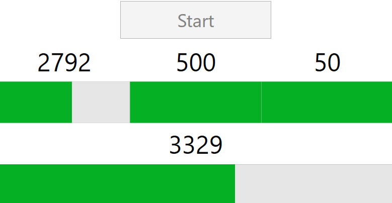
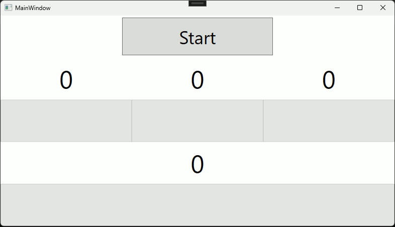

# WPF Threads

## Consegna

Si vuole visualizzare un conteggio sfruttando le istruzioni multithreads messe a disposizione dal linguaggio C#.  

Si prevedano quindi tre oggetti TextBlock WPF che visualizzano l'avanzamento di tre contatori a velocità diverse.  

Il primo scatta ogni ms e conta fino a 5000 (durata totale 5 secondi).  
Il secondo scatta ogni 10ms e conta fino a 500 (durata totale 5 secondi).  
Il terzo scatta ogni 100ms e conta fino a 50 (durata totale 5 secondi).  

Si preveda un quarto TextBlock che visualizzi il totale dei tre contatori (alla fine visualizzerà 5.550)  

Si preveda un pulsante "Start" per far partire i conteggi che rimanga disattivato durante il conteggio e si riattivi alla fine  

Opzionale: visualizzare il conteggio totale tramite una ProgressBar WPF.

## Introduzione al Problema

Se noi volessimo stampare un numero che continua ad incrementarsi e volessimo vedere il numero che si incrementa dovremmo inserire un **delay**.
Esiste la possibilità di "addormentare" il sistema per un tot di millisecondi.

```cs
Thread.Sleep(1000); // 1 secondo
```

Ma questa istruzione **blocca completamente** tutto il sistema che gestisce l'interfaccia grafica, per questo generalmente non è buona pratica creare degli `EventHandler` che durano per molto tempo.

Per questo motivo dovremmo lanciare un **thread separato** su cui spostare il pezzo di codice lento e di conseguenza la funzione di **sleep** addormenterà solamente il thread esterno.

## Il Multithreading

Quando creiamo più thread che vengono eseguiti in modo parallelo in un programma iniziamo a parlare di **multithreading**.
Per far ciò C# ci mette a disposizione un costrutto fatto appositamente per eseguire diverse funzioni su thread separati :

```cs
private void Start(object sender, RoutedEventArgs e) {
	var thread1 = new Thread(Incrementa1);
	thread1.Start();
	
	var thread2 = new Thread(Incrementa2);
	thread2.Start();
	
	var thread3 = new Thread(Incrementa3);
	thread3.Start();
	
	var threadTot = new Thread(IncrementaTot);
	threadTot.Start();
}
```

In questo metodo `Start()`, associata ad un `Button`, vengono inizializzati 4 `Thread` :
- **thread1** $\rightarrow$ Si occupa di eseguire la funzione `Incrementa1` che aggiornerà il primo contatore.
- **thread2** $\rightarrow$ Si occupa di eseguire la funzione `Incrementa2` che aggiornerà il secondo contatore.
- **thread3** $\rightarrow$ Si occupa di eseguire la funzione `Incrementa3` che aggiornerà il terzo contatore.
- **threadTot** $\rightarrow$ Si occupa di eseguire la funzione `IncrementaTot` che aggiornerà il contatore totale.

## I Metodi

Ogni metodo thread numerato avrà questo aspetto :

```cs
private void IncrementaN() {
	for(int i = 0; i <= NGIRI; i++) {
		lblCounterN.Text = i.ToString();
		pbrBarN.Value = i;
		
		Thread.Sleep(/*ms*/);
	}
}
```

Dove dipendentemente dal metodo `IncrementaN` in cui ci troviamo, quindi `Incrementa1`, `Incrementa2` o `Incrementa3`, le variabili :
- **NGIRI** $\rightarrow$ Saranno 5000, 500 o 50.
- **lblCounterN** $\rightarrow$ Saranno `lblCounter1`, `lblCounter2` o `lblCounter3`.
- **pbrBarN** $\rightarrow$ Saranno `pbrBar1`, `pbrBar2` o `pbrBar3`.
- **ms** $\rightarrow$ Saranno 1, 10 o 100.

Verrà dichiarato anche un alto metodo `IncrementaTot` :

```cs
private void IncrementaTot() {
	pbrBarTot.Maximum += 5550;
	
	for(int i = 0; i <= 5550; i++) {
		lblCounterTot.Text = TotalCount.ToString();
		pbrBarTot.Value = TotalCount;
		
		Thread.Sleep(1);
	}
}
```

## I Problemi

### Problema della Mutua Esclusione

Tuttavia una volta che manderemo il programma in esecuzione facciamo fronte ad un problema :

![calling thread exception].(./img/calling thread exception.png)

Il thread chiamante non riesce ad accedere a questo oggetto perché quell'oggetto è proprietà del **thread principale**.
Per consentire a diverse parti del codice di interagire in modo sicuro con il thread principale utilizziamo il `Dispatcher`.
In più introduciamo una variabile `TotalCount` a cui ogni Thread dovrà avere accesso per incrementare il suo valore.

```cs
private void IncrementaN(){
	for(int i = 0; i <= NGIRI; i++){
		TotalCount++;
		
		Dispatcher.Invoke(() => {
			lblCounterN.Text = i.ToString();
			pbrBarN.Value = i;
		});
		
		Thread.Sleep(/*ms*/);
	}
}
```

E la stessa cosa varrà per il metodo `IncrementaTot`, il quale suo unico compito è quello di tenere traccia del valore della variabile `TotalCount` e stamparla :

```cs
private void IncrementaTot() {
	Dispatcher.Invoke(() => {
		pbrBarTot.Maximum += 5550;
	});
	
	for(int i = 0; i <= 5550; i++) {
		Dispatcher.Invoke(() => {
			lblCounterTot.Text = TotalCount.ToString();
			pbrBarTot.Value = TotalCount;
		});
		
		Thread.Sleep(1);
	}
}
```

La funzione principale del `Dispatcher` è quella di garantire che tutte le operazioni dell'**interfaccia utente** (UI) vengano eseguite nel thread dell'interfaccia utente. 
Ciò significa che se una operazione richiede di accedere all'interfaccia utente, come ad esempio l'aggiornamento di un controllo o la modifica di un valore, il dispatcher garantisce che tale operazione venga eseguita in modo sicuro nel thread corretto.

### Problema della Concorrenza tra i Processi

Tuttavia ci imbattiamo in un altro problema quando mandiamo in esecuzione : se il thread non ha ancora terminato di incrementare la variabile `TotalCount` e nel mentre si sta eseguendo un altro Thread in quale anche lui ha accesso alla stessa variabile si creerà una situazione di confusione in cui magari entrambi i thread incrementano la variabile di `TotalCount + 1` allo stesso momento e invece di risultare `TotalCount + 2` risulterà `TotalCount + 1`.

Per questo motivo dobbiamo prestare attenzione alla **concorrenza** sulle **variabili comuni** su cui i thread agiscono per l'appunto dobbiamo garantire la **mutua esclusione** per l'accesso a quella variabile.
Per far ciò sfruttiamo il costrutto `lock`, che verrà dichiarato come :

```cs
static readonly object Locker = new object();
```

E implementeremo l'utilizzo della variabile `Locker` ogni volta che cerchiamo di accedere alla variabile `TotalCount` :

```cs
private void IncrementaN(){
	for(int i = 0; i <= NGIRI; i++){
		lock(Locker) { TotalCount++; }
		
		Dispatcher.Invoke(() => {
			lblCounterN.Text = i.ToString();
			pbrBarN.Value = i;
		});
		
		Thread.Sleep(/*ms*/);
	}
}
```

`Lock` è il costrutto di base che è usato per gestire la **sezione critica**, e noi lo useremo per garantire la **mutua esclusione** sulla variabile `TotalCount` che abbiamo dichiarato globalmente come attributo :

```cs
public int TotalCount { get; set; }
```

## I Semafori

I semafori sono costrutti integrati del sistema operativo che funzionano a livello molto basso.
L'istruzione di `Lock` già precedentemente ci permetteva di garantire la mutua esclusione, ossia la pausa di tutti i processi attorno all'istruzione da eseguire per garantire questa venga eseguita in modo completo.
Ma adesso introducendo il concetto dei semafori vengono introdotte 2 nuove istruzioni :

- **Signal** $\rightarrow$ Serve a segnalare al sistema che un insieme di istruzioni è stato eseguito con successo, oppure per segnalare la terminazione di un thread.
- **Wait** $\rightarrow$ E' una procedura che bloccante che mette in attesa il sistema finché tutte le istruzioni interessate non finiscono la loro esecuzione.

Dichiariamo il semaforo con scope globale e quindi visibile e tutti i metodi :

```cs
CountdownEvent? Semaforo { get; set; }
```

Tuttavia prima di implementare le primitive di `Wait` e `Signal` è cruciale sapere che `Wait` **non può** essere usato così all'interno di un `EventHandler`.
Per risolvere questa situazione ci serve creare un terzo thread  che esegue indipendentemente la funzione di **wait** per evitare di bloccare tutto il sistema.

Infine possiamo ultimare il metodo start che avrà questo aspetto e in cui verranno istanziati **4 Semafori** (`CountdownEvent(4)`) :

```cs
private void Start(object sender, RoutedEventArgs e) {
	StartBtn.IsEnabled = false;
	Semaforo = new CountdownEvent(4);
	
	var thread1 = new Thread(Incrementa1);
	thread1.Start();
	
	var thread2 = new Thread(Incrementa2);
	thread2.Start();
	
	var thread3 = new Thread(Incrementa3);
	thread3.Start();
	
	var threadTot = new Thread(IncrementaTot);
	threadTot.Start();
	
	var threadWait = new Thread(() => {
		Semaforo.Wait();
		Dispatcher.Invoke(() => {
			StartBtn.IsEnabled = true;
		});
	});
	threadWait.Start();
}
```

E il motivo per cui utilizziamo i semafori e per poter permetterci di eseguire un pezzo di codice che **disattiverà** la funzione di click del bottone quando inizia a venir eseguita la funzione di start e, **solamente** quando tutti gli altri thread hanno finito la loro esecuzione, abilitare nuovamente la funzione di click :

- **Disattivazione del Button** $\rightarrow$ `StartBtn.IsEnabled = false;`
- **Attivazione del Button** $\rightarrow$ `StartBtn.IsEnabled = true;`

Invece ogni metodo `IncrementaN` e `IncrementaTot` alla fine della propria esecuzione dovrà segnalare la terminazione al semaforo, e il metodi ultimati avranno questo aspetto :

```cs
private void IncrementaN(){
	for(int i = 0; i <= NGIRI; i++){
		lock(Locker) { TotalCount++; }
		
		Dispatcher.Invoke(() => {
			lblCounterN.Text = i.ToString();
			pbrBarN.Value = i;
		});
		
		Thread.Sleep(/*ms*/);
	}
	Semaforo!.Signal();
}

private void IncrementaTot() {
	Dispatcher.Invoke(() => {
		pbrBarTot.Maximum += 5550;
	});
	
	for(int i = 0; i <= 5550; i++) {
		Dispatcher.Invoke(() => {
			lblCounterTot.Text = TotalCount.ToString();
			pbrBarTot.Value = TotalCount;
		});
		
		Thread.Sleep(1);
	}
	Semaforo!.Signal();
}
```

## Problema dei Millisecondi

Possiamo dedurre quindi che una volta mandato in esecuzione il programma tutto quanto funzioni alla perfezione senza nessun problema di tipo concorrente dopo la pressione del tasto **Start**.
Il che risulta vero fino ad un certo punto, dove durante l'esecuzione notiamo che non tutti i contatori terminano allo stesso momento.



Questo è dovuto ad un problema delle API di Windows che non riescono a mettere in pausa il Thread per 1ms preciso nel contatore da 5000 non rispetta, bensì riesce solamente a rappresentare un approssimazione di attorno i 15ms.
Questa imprecisione è spiegata in questa risposta di un utente su Stack Overflow : https://stackoverflow.com/a/6254753

### Risoluzione

Per risolvere il problema ho implementato nel mio programma questa soluzione di Datchung su Stack Overflow : https://stackoverflow.com/a/67060100/17043535

In cui viene implementata una classe `WinMMWrapper` all'interno del progetto :

```cs
 public class WinMMWrapper {
	[DllImport("WinMM.dll", SetLastError = true)]
	public static extern uint timeSetEvent(int msDelay, int msResolution,
		TimerEventHandler handler, ref int userCtx, int eventType);
	. . . 
}
```

Nella classe `MainWindow` invece dichiareremo una variabile array di `WinMMWrapper` che nel costruttore verrà inizializzata con 4 elementi (Lo stesso numero di metodi Incrementa che abbiamo) :

```cs
WinMMWrapper[] Timers { get; set; }

public MainWindow() {
	InitializeComponent();
	
	Timers = new WinMMWrapper[4];
}
```

E in ogni metodo  `IncrementaN` verrà implementata nel modo seguente :

```cs
private void IncrementaN() {
	int i = 0;
	uint id = 0;
	Timers[/*idx*/] = new WinMMWrapper( /*ms*/, 0, WinMMWrapper.TimerEventType.Repeating, () => {
		lock (Locker) { TotalCount++; }
		i++;
		Dispatcher.Invoke(() => {
			lblCounterN.Text = i.ToString();
			pbrBarN.Value = i;
		});
		if (i == /*NGIRI*/) {
			WinMMWrapper.timeKillEvent(id);
			Semaforo!.Signal();
		}
	});
	id = Timers[/*idx*/].StartElapsedTimer();
}
```

Dove :
- **ms** $\rightarrow$ Saranno 1, 10 o 100.
- **idx** $\rightarrow$ L'indice del array di `WinMMWrapper` che sarà 0, 1 o 2.

### Spiegazione della Soluzione

L'implementazione della classe permette di istanziare u nuovo oggetto `WinMMWrapper` che  permetterà di eseguire una **lambda expression** in loop tramite il parametro `WinMMWrapper.TimerEventType.Repeating`.
Questa funzione è eseguita in modo asincrono rispetto all'essecuzione del Thread, infatti una volta istanziato l'oggetto verrà subito eseguita l'istruzione `id = Timers[/*idx*/].StartElapsedTimer()` che restituirà l'**id** del timer in funzione all'indice **idx**.

Il metodo che viene eseguito in lambda expression invece girerà in loop con una pausa di 1ms nel mezzo e una volta che il contatore raggiunge il valore di `NGIRI` prestabilito terminerà il timer tramite il suo **id** e segnalerà al `Semaforo` la sua terminazione.
Il metodo `WinMMWrapper.timeKillEvent(id)` l'ho implementato da questa repository GitHub : https://gist.github.com/mjs3339/b98bbf4075be0176ac521c9875652dfe

## Conclusioni

Il programma funziona correttamente :


